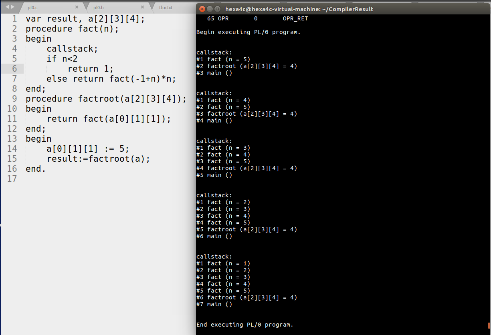

##14.callstack的原理及其实现

### 14.1.实现的功能

添加了一条`callstack`语句，可以在运行过程中打印样例程序的调用栈信息。使用规则如下：

```c
	...
	statement1;
	callstack;
	statement2;
	...
```

### 14.2.实现的原理

1. 产生式如下：

   ```c
   statement	->	...
   			->	'callstack'
     			->	...
   ```

2. 打印原理：从当前函数的`bp`沿着调用链上溯到`main`，期间通过上溯过程中的当前pc来确定函数名及相关的信息。

### 14.3.实现的思路

由于每次调用一个函数时，都会将参数、父函数的基址、调用时的父函数pc压栈，因此打印过程中从当前函数的`bp`沿着调用链上溯到`main`即可。

这个过程中需要确定函数名以及函数的参数名，由于朱嘉润同学之前在实现函数参数传递的时候添加了一个存储函数的函数名及其他相关信息的数据结构`stnode`，因此这次只需在其中添加存储参数名、参数数目和函数在代码段中的地址即可。如下：

```c
typedef struct stnode
{
	...
	//ljq added 12.10 for callstack
	int address;
	char paraname[10][100];
	int paranum;
	...
}stnode;
```

在上溯过程中，由于栈内存储了父函数调用时的`pc`，而每个函数生成的指令中只有一条`INT`而且是在第一条，因此可以从父函数的调用时的`pc`沿着代码段上溯到第一个`INT`即为该父函数的代码段地址。然后再到`stnode`的链表中遍历，即可获取函数相关的信息。

### 14.4.具体实现

1. pl0.h中：

   1. 在`symtype`中添加`SYM_CALST`用于识别`callstack`，关键字集`word`中添加`"callstack"`，关键字代号集`wsym`中添加`SYM_CALST`，指令集`opcode`中添加指令`CALST`，指令符号集`mnemonic`中添加`CALST`。

   2. 在`stnode`中定义中添加相关元素如上。

   3. 添加暂存参数名的字符串数组，参数数量，以及用于在将数组参数中的数字转化为字符串时的字符数组buffer：

      ```c
      //===========for callstack*/
      char tmpparaname[10][100];
      int tmpparanum;
      char numstring[10];
      ```

2. pl0.c中：

   1. 在`statement`函数中添加`callstack`分支，如下：

      ```c
      //lijiquan, 12.9, Add callstack
      	else if (sym == SYM_CALST)
      	{
      		gen(CALST, 0, 0);
      		getsym();
      	}
      ```

   2. 在`initchainlist`, `nodeinsert`, `block`中添加相应的位置添加对`stnode`中新增元素的相应处理

   3. 添加函数`ntos`用于将分析数组参数时维度中的数字转化成字符串放到参数名数组中。

   4. 在`interpret`中添加`CALST`分支，用于处理该指令相关内容。具体原理见上

### 14.5效果



