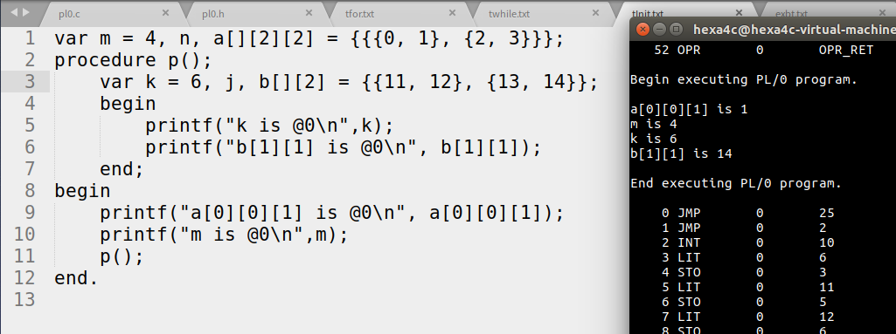

## 22.变量初始化的原理及实现

### 22.1实现的功能

1. 添加了普通变量在声明时的初始化

   ```pascal
   var i, j = 4, m;
   ```

2. 添加了数组变量在声明时的初始化，并且声明时可以缺省第一维，通过初始化内第一层元素个数来确定第一维大小

   ```pascal
   var a[][2] = {{1, 2}, {3, 4}}, b[3] = {1, 2, 3};
   ```

### 22.2实现的原理

修改后的产生式如下：

```c
declaration		->	vardeclaration
				|	constdeclaration
				|...

vardeclaration	->	'var' variable

variable		->	identifier idsucc ',' variable

idsucc			->	varInit
				|	'[' number ']' idsucc arrayInit

varInit			->	epsilon
				|	'=' number

arrayInit		->	epsilon
				|	'=' '{' arrayInitList '}'
				|	'='	'{' '}'

arrayInitList	->	arraySubInit
  				|	arrayInitList ',' arraySubInit

arraySubInit	->	number
				|	{arrayInitList}
				|	'{' '}'
```

### 22.3实现的思路

1. 为了能准确的给变量进行初始化，在这里采用在函数最开始生成一系列`LIT`和`STO`指令来进行初始化。

2. 由于变量初始化的语法分析实在生成该函数的`INT`指令之前，这样就有两个方案：

   * 先生成指令，再将指令后移；
   * 不生成指令，仅记录指令的主要信息，即变量地址和初始值，然后再在生成`INT`指令之后，根据相关信息来生成指令串

   考虑到变量的声明后面还有函数的声明，这样指令的后移会变得异常的麻烦，因此采取第二种方案。

3. 由于我们写的`pl0`体量较小，因此记录信息用一个比较大的数组就可以胜任了。

### 22.4具体实现

1. pl0.h中：

   1. 添加一个存储初始化信息的结构体`VartoAddr`：

      ```c
      //ljq added 12.14 for variable initializing
      typedef struct ValtoAddr
      {
      	int value;
      	short address;
      }ValtoAddr;
      ```

   2. 在`stnode`数据结构中添加如下元素用来存储函数的初始化信息：

      ```c
      typedef struct stnode
      {
        	...
      	//ljq added 12.14 for variable initialing
      	ValtoAddr InitValue[100];
      	int InitVarNum;
      }stnode;
      ```

   3. 添加相关的错误提示信息

2. pl0.c中：

   1. 在`block`中生成`INT`语句后添加生成初始化指令串的语句：

      ```c
      	//ljq 12.14 for initializing variables
      	int j;
      	for (j = 0; j < Func->InitVarNum; ++j)
      	{
      		gen(LIT, 0, Func->InitValue[j].value);
      		gen(STO, 0, Func->InitValue[j].address);
      	}
      ```

   2. 修改`initchainlist`和`nodeinsert`以适配修改过的`stnode`

   3. 在`enter`中添加对`ID_VAR`的初始化语句，并将`ID_ARRAY`分支外提为`enter_array`以简化`enter`

   4. 在`enter_array`内添加初始化语句，并添加用于数组初始化的语法分析递归调用的函数`init_array`

3. 语义错误输出与恢复

   1. 在pl0.h中添加了相应的错误信息，并在分析时遇到相应的问题时报错，主要是以下几种错误：
      * 符号错误
      * 维度比声明的大
      * 维宽比声明的宽
   2. 由于错误恢复的本质是抛弃现有分析，往后找，一直到一个正确的符号重新分析。但是这里后面的符号与前面是有很强依赖的。如果发生错误，直接抛弃，那么是很有可能产生更多的错误的，这样就违背了错误恢复的本意。另一方面，初始化的错误会对后面造成很多影响，不是可以忽略的。因此这里没有做错误恢复。

### 22.5效果

