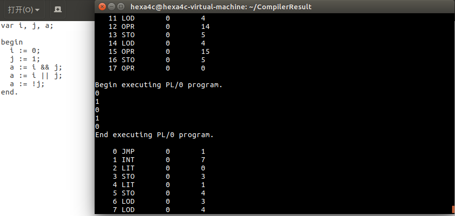
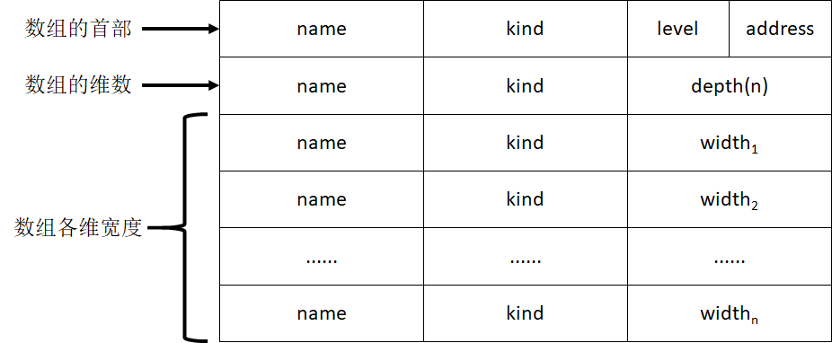
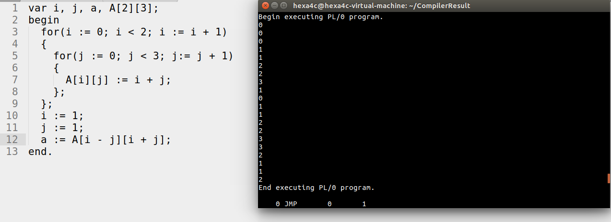

# pl0设计报告

李继权 PB15111624    董仕 PB15111607    杨文涛 PB15111652    朱嘉润 PB15111630     17.12.16

------

## 目录

#### [0.代码开发环境与团队合作](#0.代码开发环境与团队合作)

#### [1.注释的原理及实现](#1.注释的原理及实现)

#### [2.表达式值的原理及实现](#2.表达式值的原理及实现)

#### [3.非数组参数传递的原理及实现](#3.非数组参数传递的原理及实现)

#### [4.函数返回值的原理及实现](#4.函数返回值的原理及实现)

#### [5.数组的原理及实现](#5.数组的原理及实现)

#### [6.数组传参的原理及实现](#6.数组传参的原理及实现)

#### [7.短路计算的原理及实现](#7.短路计算的原理和实现)

#### [8.for循环的原理及实现](#8.for循环的原理和实现)

#### [9.EXIT的实现](#9.EXIT的实现)

#### [10.自增自减的实现](#10.自增自减的实现)

#### [11.简单输入的实现](#11.简单输入的实现)

#### [12.格式化输出的实现](#12.格式化输出的实现)

#### [13.随机数的实现](#13.随机数的实现)

#### 14.callstack的实现

#### [15.条件运算符，位移运算的原理及实现](#15.条件运算符，位移运算的原理及实现)

#### [16.赋值表达式的原理及实现](#16.赋值表达式的原理及实现)

#### [17.支持嵌套的switch语句的实现](#17.支持嵌套的switch语句的实现)

####[18.break和continue的实现](#18.支持嵌套的continue和break语句的实现)

#### [19.列表式赋值的原理及实现](#19.列表式赋值的原理及实现)

#### [20.变量引用传参的原理及实现](#20.变量引用传参的原理及实现)


---

## 0.代码开发环境与团队合作

### 0.1 代码开发环境

​	代码大部分于Linux下开发及测试，使用的Linux开发版均为Ubuntu。有若干部分（如返回值实现）在Windows下开发。在Windows下，经测试，使用Dev C++可以执行全部测试样例。

​	在Linux下，可以直接使用Makefile进行编译，默认编译器为gcc，可自行进行修改。

### 0.2 团队合作

​	由于涉及多人合作，因此使用了一个托管在某个组员个人服务器上的git仓库进行合作，如果有实现冲突的时候手工合并，否则直接对主分支覆盖。基于此原因，可能会出现某些遗漏进而导致bug。但是这种合作确实相当高效。

------

## 1.注释的原理及实现

### 1.1 注释的原理

​	注释共有两种风格：

```C
/*   anotations    */
//anotations...
```

​	一种是换行的，一种是不换行的，由此，可以写出支持注释的正则表达式：

```
/(/(symbols)'\n'|*(symbols)*/)
```

​	其中*不是闭包，'\n'代表换行符。

​	因此，只需要在读入代码时进行循环分析即可。

### 1.2 注释的实现

​	只需在getch()函数中利用上述正规式进行分析即可，遇到注释则跳过。

### 1.3效果


### 1.4 后续思考

​	回过头来看这部分，其实并不需要将注释忽略，只要跳过即可，这样可以输出带注释的代码。

------

## 2.表达式值的原理及实现

### 2.1实现的功能

1. 添加逻辑运算符&&，||，和!

   ```c
   var i, j, a;

   begin
     i := 0;
     j := 1;
     a := i && j;
     a := i || j;
     a := !j;
   end.
   ```


### 2.2实现原理

1. 逻辑运算符相关的产生式：

   ```
   expression			->	logic_or_expression '||' logic_or_exprsssion

   logic_or_expression	->	logic_and_expression '&&' logic_and_expression

   logic_and_expression->	...
   ...
   factor				->	'!' factor
   						|...
   ...
   ```

   ​

### 2.2具体实现

1. 逻辑运算符的实现：
   * 在pl0.h中，首先要在`symtype`中添加`SYM_BITAND`和`SYM_BITOR`以区分逻辑运算与位运算；其次要在`oprcode`中添加相应的`OPR_AND`，`OPR_OR`，`OPR_ANTI`；然后还要将`ssym`中的原来的`SYM_AND`和`SYM_OR`修改为`SYM_BITAND`和`SYM_BITOR`。
   * 在pl0.c中，首先要在`getsym()`中添加相应的词法分析；然后要在`void factor(symset fsys`中的`if-else`分支中添加`sym == SYM_ANTI`的选项；然后由于将原来的`void expression(symset fsys)`里的内容是加减运算，优先级较低，将它们迁移至一个新的函数`void addictive_expression(symset fsys)`；再添加两个新的函数`void logi_and_expression(symset fsys)`和`void logi_or_expression(symset fsys)`来处理逻辑与或运算的内容。

### 2.3效果



------

## 3.非数组参数传递的原理及实现

### 3.1 实现的功能

1. 支持函数定义时加参数，具体格式如：

   ```pascal
   procedure funcname(arg1,arg2,arg3<,more args...>);
   begin
   	<func body> 	//you can use arguments here
   end;
   ```

2. 不再支持基于call的带参函数调用

3. 支持复杂的作用域规则：在函数嵌套时，除了传递的同名参数，子函数都可以调用父函数的变量并改变其值，简要的说就是同名变量以作用域最近的为准，如：

   ```pascal
   var b,c,d;
   procedure myfunc1(a);
   begin
   	a:=a+1;
   	b:=b+2; 	//not declared!
   end;
   //main
   begin
   	b:=0;
   	c:=1;
   	myfunc1(c);
   end.
   ```

   最终结果是b为2，而a为3。

4. 由于实现原因，仍然支持不带参无括号的过程声明和调用。

5. [内部功能]为每个作用域（函数/过程）添加了自己的符号表。Func指针指向当前正在操作的函数的符号表结点。

6. 支持函数参数表达式，如：

   ```pascal
   var a,b,d;
   procedure foo(c);
   begin
   	c:=c+1;
   	return c;
   end;
   begin
   	a:=1;
   	b:=2;
   	d:=foo(a+b);
   end.
   ```

### 3.2 实现原理

​	实现的主要原理有两个：

1. 作用域规则

   作用域规则遵循最近作用域有效规则，类似于C，即在层次较深的作用域中同名变量以最接近的浅层作用域为准。

2. 函数声明产生式

   ```
   ProcDecl -> procedure id ‘(’ ParaList ‘)’ ;
   			  | procedure id ‘(’ ‘)’;
   ParaList -> ParaList ‘,’ Para 
   			  | Para
   Para   -> expression 
   ```
### 3.3 实现思路

1. 用链表实现一个结构，每个结点保存一个符号表。    
2. 把table变成指针，指向某个符号表 。
3. 每次创建新的procedure，就创建一个结点，对应的就会有一个新的符号表，把table指向这个符号表，复制其父节点的符号表。
4. 对于参数列中出现的父结点已有的变量，以新的为准，覆盖父结点的。
5. 对于函数声明，进行参数检测，复制到一个临时的数组，在创建结点时把参数名复制过去。
6. 至此子函数部分的声明代码基本完成，接下来在其调用时（遇到CALL），利用APOP指令，将参数逐个放到栈顶。添加一个"/pbase"指针用于平栈，即每次表达式参数计算完成后将栈顶指针恢复到计算前栈顶指针+1的位置（后续发现这是个不必要的设计，具体见3.7）。

### 3.4 具体实现过程

1. 添加链表式的table定义，实现链表的插入和删除函数，将table修改成指针。每次链表插入和删除时，改变table指向，改变dx，tx。

2. 修改enter函数，每次遇到ID_PROCEDURE记录下这个函数名，为下面返回函数汇编地址做准备。修改pl0.h，添加tmpaddress，记录函数汇编地址。

3. 修改block函数，在函数开头建立新结点，函数结尾删除结点；   在调用函数处添加被调用者地址记录：用在block结尾处tmpaddress记录地址，在调用函数结束后将这个地址赋到父函数的符号表中去。

4. 在pl0.h中添加position函数的声明，以支持在其他函数中调用。

5. 修改pl0.h，添加一个临时字符数组，存储参数列。注意，暂时最多支持50个参数，参数名最长50。   在pl0.h中添加全局变量funcparam，记录参数个数  。修改了block函数，在sym_procedure处添加了参数声明的代码，将参数放入一个临时的参数表（tmpparam），并计算参数个数。
    暂时不修改procedure后面带分号这个设定   修改block函数的INT，加上参数个数。

6. 使用一个新的param_enter函数，将临时参数表中的参数一个个加入到符号表。

7. 将base指针插入符号表：

  （1）修改pl0.h，添加类型：ID_POINTER    

  （2）修改block函数：在执行statement之前将base插入符号表，类型为ID_POINTER，为了避免与变量名冲突，base指针称为"/pbase"（因为变量名中不能有特殊符号）。如果符号表中已有/pbase指针，重写/pbase指针的level。

8. 在调用处实现参数逐个入栈：     

   （1）在pl0.h中添加指令 APOP，ASTO     

   （2）APOP两个域： 第一个域废弃，为0，第二个域为/pbase的地址             

   ASTO两个域： 第一个域废弃，为0，第二个域为/pbase的地址     

   （3）修改interpret函数：在解释器中实现APOP，具体是将栈顶参数放到base+1处，同时base++，然后top变成base+1     

   （4）修改interpret函数：在解释器中实现ASTO，具体是将top存到/pbase中     

   （5）修改factor函数：在函数调用处（ID_PROCEDURE），先将当前栈顶指针存到base，然后循环，对每个参数表达式执行expression（），此后参数位于栈顶，执行APOP，将参数下沉到base+1处，top也下沉到此处。

9. 在函数开头实现从栈中获取参数值：     

   （1）在pl0.h中添加指令LODA     

   （2）LODA指令两个域：第一个域是参数个数，第二个域为参数次序，为1,2,3...     

   （3）修改interpret函数：在解释器中实现LODA

   （4）修改block函数：在生成INT后，利用全局的Func指针，获得当前函数的参数个数，逐个生成LODA指令，从栈中取出参数。     

### 3.5 效果


### 3.6 更多工作

​	只是简单地做了一些错误检测，没有做详尽的改动。包括参数不匹配，函数声明不对等等均不知道调用后会产生何种后果。这里需要做更多改进。

### 3.7 后续思考

1. 当时觉得虽然expression会弹栈，但是不确保有没有后续的表达式指令会不弹栈影响到栈中参数的存储，但是一直到基础部分设计完成，expression都支持了弹栈，因此ASTO和"/pbase"这种完全是没有存在的必要的。
2. 在设计时，觉得获取参数应该由子过程完成，因此使用了LODA，其实完全不必要，只要生成子函数参数符号表的时候，将参数地址设置为-1,-2,-3...即可，这里有点费力不讨好了。

------

## 4.函数返回值的原理及实现

### 4.1 实现的功能

实现带值 return 语句，实现不带值 return 语句，实现类似 C 语言的函数调用。

### 4.2 实现的原理

将 return 后面的表达式的值算出后，留在栈顶。当返回时将栈顶的值传递到原指令序列的数据栈栈顶。
这样在调用完有返回值的函数后，如同运行了一次 expression ，在栈顶留下返回值。后续的指令将会利用这个值，从而实现函数返回值的调用。

不带值的 return 语句类似于 C 语言的 void 函数的 return。它与原版的 pl0 的 procedure 相同，只需要去掉 call 的显式调用。

值得注意的是，返回后要将栈中残留的参数弹栈。

### 4.3 实现的思路

有返回值的函数在具体使用的过程中和 expression 的用法很相近，因此考虑在 expression 对 ID 为 procedure 的标识进行处理，让它执行一次 call 指令调用函数。

返回的时候 return 后跟着的是一个 expression， 当已经准备好返回时，栈顶便是需要返回的值。这时我们把这个值
放到 caller 的栈顶，就可以实现函数的返回值。

去掉 call 需要允许 statement 中可以单独出现 ID，同时如果是 variable 则转向赋值语句的分析，如果是 procedure 则执行
call 指令。这样就不需要使用关键字 call 显式调用函数了。

### 4.4 具体实现

首先由于原来的 pl0 的解释器中只有 OPR_RET，只能为函数的调用返回实现栈的操作。因此考虑添加指令 RET，对有返回值调用的
函数返回做支持。

RET 的指令要做的工作是 OPR_RET 的超集。除了要处理函数返回的栈基值等问题，还要将当前栈顶值缓存，在返回结束后在栈顶
加入那个缓存的值，作为该函数的返回值。

然后是 return 语句的支持。当一条 statement 以 return 开头的时候，如果它后面什么都没有，说明这是一个空函数，那么
它的行为应该是 OPR_RET；但如果 statement 后面跟着的是一个 expression，那么它就要先计算 expression 的值，
然后调用 RET 指令将有返回值函数返回，返回后要将栈中残留的参数弹栈。（对OPR_RET作同样处理）

最后是对函数隐式调用的支持。只要在 expression 中见到函数名（有值函数），或是 statement 中直接出现的函数名
（空函数），就应该生成 call 指令调用函数。从而 call 不需要再被使用，于是为保留字 call 添加报错；
如果仍使用保留字 call，就会提示“该保留字已经不再受支持”。

### 4.5 效果

```pl0

var a,b,c,d,e,f,g;
procedure func1(p1,p2,p3);
begin
    d := p1 + p2;
	e := p2 + p3;
    f := p1 + p3;
    g := d * e * f;
    return g;
end;

procedure func2(p1);
begin
    b := p1*10;
end;

begin
	a := 1;
    b := 2;
	c := 3;
    a := 1 + func1(a,b,c);
    c := 100;
    func2(c);
end.

```

比如上面的 pl0 代码中，定义了两种函数：func1 的有返回值函数和 func2 的空函数。a := 1 + func1(a,b,c);语句中就会先
调用 func1 计算返回值，再计算返回值加上1，最后赋值给 a。而空函数的执行和以往类似，执行后不会再栈顶留下痕迹。

```pl0

var result,i,tmp;
procedure fact(n);
var nm1;
begin
	nm1:=n-1;
	if n<2 then return 1;
	else return fact(nm1)*n;
end;
begin
	i:=5;
	result:=fact(i);
end. 

```

再比如返回值是另一个函数的递归函数。当 return 的时候回先计算后面的 expression，而 expression 中有函数名出现，
则先调用这个函数；同理下一层函数又回向下继续调用自己，从而实现递归。

------

##5.数组的原理及实现

### 5.1实现的功能

​	支持数组的使用，包括声明，作为语句的左值和右值的使用，例如：

```pascal
var v1, v2, A[2][3][2];
...
A[1][2][1] = 1;
...
v1 = A[1][2][1];
```


###5.2实现的原理

1. 数组的相关产生式：

   声明：

   ```
   declaration		->	vardeclaration
   					|constdeclaration
   					|...

   vardeclaration	->	'var' variable

   variable		->	identifier idsucc ',' variable

   idsucc			->	epsilon
   					|'[' number ']' idsucc
   ```

   作为右值：

   ```
   factor			->	identifier id_succ
   					|...

   id_succ			->	epsilon
   					|array_succ
   					|...

   array_succ		->	'[' expression ']' array_succ
   ```

   作为左值：

   ```
   statement		->	l_value	'=' expression

   l_value			->	identifier id_succ
   					|...

   id_succ			->	epsilon
   					|array_succ
   					|...

   array_succ		->	'[' expression ']' array_succ
   ```

2. 数组元素的寻址原理，偏移量计算公式如下：

   设该数组声明为$A[M_1][M_2]...[M_n]$，调用的数组元素为$A[E_1][E_2]...[E_n]$，计算地址的公式如下：

   $address = (...(((E_1 ) * M_2 + E_2) * M_3 + E_3)...) * M_n + E_n$

   ​

###5.3实现的思路

1. 数组在符号表内的存储形式

   新添加了三种数据结构用来存储数组在符号表内的相关信息

   - array，数组在符号表内的数组名信息：

     ```c
     typedef struct 
     {
     	char name[MAXIDLEN + 1];
     	int kind;
     	short level;
     	short address;
     } array;
     ```

   - dimensionHead，数组在符号表内存储的数组维数信息：

     ```c
     typedef struct 
     {
     	char name[MAXIDLEN + 1];	//仍存储数组名
     	int kind;					//仍存储ID_ARRAY
     	int depth;
     } dimensionHead;
     ```

   - dimension，数组在符号表内存储的各维的宽度：

     ```c
     typedef struct 
     {
     	char name[MAXIDLEN + 1];	//仍存储数组名
     	int kind;					//仍存储ID_ARRAY
     	int width;
     } dimension;
     ```

   在符号表中，一个数组的相关信息存储如下图：

   

   ​

2. 为数组的实现而添加的指令：

   - LEA，取地址，从符号表中读取变量地址或是数组首地址：

     ```c 
     case LEA:
     			stack[++top] = base(stack, b, i.l) + i.a;
     			break;
     ```

   - LODAR，由于数组里一个数据的地址是算出来后放到栈顶的，与以前的从符号表中获取地址不一样。因此添加了这样一个读取栈顶的地址并取值的指令：

     ```c
     case LODAR:
     			top ++;
     			stack[top] = stack[stack[top - 1]];
     			break;
     ```

   - STOAR，添加原因与LODAR相同。其作用是读取次栈顶中的地址并将栈顶值存入该地址：

     ```c
     case STOAR:
     			stack[stack[top - 1]] = stack[top];
     			printf("%d\n", stack[top]);
     			top = top - 2;
     			break;
     ```

3. 数组寻址相关操作的指令设计，以5.2中的为例：

   - 第一步，取数组首地址；
   - 第二步，将一个$0$压栈（这个是偏移地址$offset$），令$i = 1$；
   - 第三步，计算$E_i$；
   - 第四步，如果$i = n$， 进入第七步；否则，添加加法指令，即将$E_i$与$offset$相加；
   - 第五步，取$M_{i+1}$；
   - 第六步，添加乘法指令，即将$M_{i+1}$与$offset$相乘，$i = i + 1$，进入第三步；
   - 第七步，添加加法指令，即将首地址与$offset$相加，最终在栈顶得到该数组元素的地址。

   此外，在作为右值时在这之后加上LODAR以从该地址将数组变量的值取到栈顶。在作为左值时，处理完等式右值后，再利用STOAR将栈顶的值存入次栈顶的数组地址所指向的地址处。

   ​

### 5.4具体实现

1. 在pl0.h中添加上述的数据结构。

2. 在指令实现部分，即pl0.c的`interpret()`中添加相关指令的实现，当然，在pl0.h中也要有与指令相关的指令符的`opcode`和`mnemonic[MAXINS]`中相应的添加。

3. 数组声明部分：

   由于数组的声明部分要求可以实现与普通的变量一起声明，因此在声明部分的实现上，在文法分析读到`var`时，不管后面是什么，一起进入`vardeclaration()`进行分析，在函数`enter()`中才给予不同的分析。即在`enter()`中添加符号表项的`switch`语句中添加对数组的数组名符号后面的维度的语法分析。

   同时，也要在`main()`中的声明符号集`declbegsys`中添加相应的项。

   在pl0.h中要在`symtype`和`ssym[NSYM + 1]`中相应地添加`SYM_LSBRAC`和`SYM_RSBRAC`，在`idtype`中添加`ID_ARRAY`，在`csym[NSYM + 1]`中添加`[`和`]`。

4. 数组变量作为右值的处理

   因此，数组的分析与常量，变量，和调用的函数是同一级的，都是在获取到`ID_IDENTIFIER`之后进行的进一步分析。因此，在该分支内的`switch`语句中添加`ID_ARRAY`选项，其内容是用一系列的指令将该数组变量的地址放到栈顶，再利用LODAR以从该地址将数组变量的值取到栈顶。

5. 数组变量作为左值的处理

   在`statement()`中获取到`sym = SYM_IDENTIFIER`的分支中，在分析到等号之前，要添加在该符号是数组时对数组名之后的维度的语法分析，和计算数组元素地址的指令的产生。在再分析完等号后添加STOAR将栈顶的值存入次栈顶的数组地址所指向的地址处。

   ​

###5.5效果



结果中显示的依次是以下语句的值：

```c
i := 0;				//0
j := 0;				//0
A[0][0] := 0 + 0;	//0
j := j + 1;			//1
A[0][1] := 0 + 1;	//1
j := j + 1;			//2
A[0][2] := 0 + 2;	//2
j := j + 1;			//3
//j < 3 不成立;
i := i + 1			//1
j := 0;				//0
A[1][0] := 1 + 0;	//1
j := j + 1;			//1
A[1][1] := 1 + 1;	//2
j := j + 1;			//2
A[1][2] := 1 + 2;	//3
j := j + 1;			//3
//j < 3 不成立;
i := i + 1;			//2
//i < 2不成立
i := 1;				//1
j := 1;				//1
a := A[0][2];		//2
```


### 5.6更多工作

​	虽然现在的实现能够完成目标，但是有一些地方实现的还是略为简单粗暴，不是很规范。比如说在`enter()`函数中添加的数组的其他信息的分析，写成一个函数的形式可能会更好，后续会对这些地方进行一定的优化。

​	另外，虽然c语言里面没有，但是经讨论，觉得最好加上数组越界相关的处理，这个会在后续加上。

-----

## 6.数组传参的原理及实现

### 6.1 实现的功能

1. 支持整个数组作为参数被调用，如：

   ``` pascal
   var a[2][3][4],i;
   procedure p(a[2][3][4]);
   begin
   	return a[1][1][1];
   end;
   begin
   	i:=p(a);
   end.
   ```

2. 支持数组元素作为参数被调用，如：

   ``` pascal
   var a[2][3][4],i;
   procedure p(tmp);
   begin
   	return tmp;
   end;
   begin
   	i:=p(a[1][1][1]);
   end.
   ```

3. 依旧支持类C的作用域规则，同名变量以最近作用域为准，如:

   ``` pascal
   var a[2][3][4],b[2][3][4];
   procedure p(a[2][3][4])
   	procedure q(b[2][3][4])
   	begin
   	end;
   begin
   	q(a);	//此处a是b，则在q中，b是实际上的b
   	q(b);	//在q中，b是实际上的b
   end
   begin
   	p(b)	//在p中，a是实际上的b
   end.
   ```

   子过程中可以调用父过程中的数组（只要不与参数同名）。

### 6.2 实现的原理

```
   ProcDecl -> procedure id ‘(’ ParaList ‘)’ 
   			  | procedure id ‘(’ ‘)’
   ParaList -> ParaList ‘,’ Para 
   			  | Para
   Para   -> expression
   			  |array
```
### 6.3 实现的思路

1. 函数声明时的参数处理：在分析参数时，如果发现这是数组，将其记录下来，并将维度等信息记录下来，添加到该函数对应的符号表中，注明类型的参数数组（ID_PARRAY），这个数组添加过程可能有两种情况：

   （1）与已有的某个数组同名：覆盖该数组，修改其维度为参数数组的维度。

   （2）没有同名数组：在符号表中建立一个新数组，类型为ID_PARRAY

2. 子函数调用参数数组时的处理：根据要求，父函数会将数组首地址传进来，因此分析到数组类型是ID_PARRAY时，不再使用原有LEA指令获取数组首地址，而是使用LOD指令，将数组首地址取出，后面维度分析与普通数组相同。

3. 子函数将参数数组作为参数向下传递的处理：类似地，使用LOD指令，将参数数组地址取出后作为参数压栈即可。

4. 函数调用带数组参数的子函数时的处理，如：

   ```  pascal
   var i,a[1][1];
   procedure p(a[1][1]);
   begin
   	...
   end
   begin
   	i:=p(a);
   end.
   ```
   在i:=p(a);这句的分析处，首先会读取参数列表，得知该参数是数组后，将数组首地址和其他数组参数压栈。类似地，若该数组是参数数组，也将数组首地址和其他参数压栈。

### 6.4 具体实现

1. 子函数声明时的参数处理：     

   （1）pl0.h：修改tmpparam数组的定义，添加kind和value属性。实际上就是改成comtab     

   （2）pl0.c：修改所有用到tmpparam的地方，tmpparam[i]改成tmpparam[i].name     

   （3）pl0.c：block：分析参数时，区分类型，如果有[的，则类型设为ID_ARRAY，否则是ID_VARIABLE (#Z1)     （4）pl0.c：param_enter：复制符号表时，区分ID_VARIABLE和ID_ARRAY，前者对父函数中的同名变量作覆盖处理，后者不进行覆盖，完全保留同名数组信息，分两种情况：a.与父函数中某个数组同名：添加一项表项，类型为ID_PARRAY，表明是数组参数；b.无同名数组：在子函数符号表中创建一个新数组，在栈中显式地存储地址，深度，每一维的宽度(#Z2)     

   （5）pl0.c：添加函数old_position，这个是原来的position，能够正确处理参数传递时的取position值（#Z3）     

   （6）pl0.h：添加ID_PARRAY（#Z4）     

   （7）pl0.c：param_enter：将参数数组的类型设置成PARRAY（#Z17）

2. 子函数分析代码时遇到参数数组的处理：     

   （1）pl0.h：添加变量isarrayparam，初始化为0（#Z5）     

   （2）pl0.c：position：修复了position的一个bug：若第一个定义的是数组且对改数组寻址，会返回0（#Z7）     

   （3）pl0.c：factor：修改factor函数，有则说明是参数，不需要用LEA。此时先把地址LOD出来，然后利用该数组的名字从前面开始遍历，进行寻址，完成对数组作为右值的处理（#Z6）     

   （4）pl0.c：statement：修改statement函数，完成对数组作为左值的处理（#Z8）

3. 调用时的数组参数处理：     

   （1）pl0.h：修改stnode定义，加入参数列表的记录；添加error(31)：参数类型不匹配；添加error(33)：找不到该函数（#Z9）     

   （2）pl0.c：node_delete：作修改，分析完成的函数不需要离开链表，移交链表控制权即可（#Z10）     

   （3）pl0.c：node_insert：作修改，首先是加入链表变成尾插，插入func后面，然后是加入参数列表（#Z11）     

   （4）pl0.c：新增函数int *node_getplist(char *name)：在链表中寻找，获取该名字的参数列表，返回参数列表（kind数组）（#Z12）     

   （5）pl0.c：node_insert：添加将tmpparam复制到paralist，只需记录类型即可（#Z13）     

   （6）pl0.c：factor：在调用函数时调用node_getplist获取参数列表paralist，根据paralist分析参数类型，如果类型不匹配则报error；如果匹配到数组类型，先对数组参数一一比对，比对正确后将首地址压栈，否则报error（#Z14）     

   （7）pl0.c：position：修改使得能够在遇到PARRAY时执行跟ARRAY同样的动作（#Z15）     

   （8）pl0.c：nodeparam：修改使其能根据函数名匹配来返回值（#Z16）


### 6.5 效果


### 6.6 更多工作

1. 添加更为复杂而稳健的参数类型匹配：对数组的类型及维度进行匹配，即一一比对维度个数和大小，若有误则报错。
2. 支持数组指针。

------

## 7.短路计算的原理和实现

7.1实现的功能

支持在条件判断的时候能够自动增加条件短路算法，提高了条件判断时的效率，使得程序的时间复杂度降低。

7.2实现的原理

短路算法是指，例如条件为a&&b，当执行的时候，a=0，b=1，则执行到a=0时，就可以判断这个条件显然不成立，应该直接跳转。这样节省了后面的b以及逻辑和运算。即使用前序条件来判断整个条件是否能够成立，并返回相应的结果。但在实现的时候仍然需要注意一些细节，比如，当面对两个以上的条件式组成的条件时，发现上述做法有漏洞，如a&&b||c，假设a=0，b=1,c=1，按照上一段叙述算法，则当判断到a为零，就会直接跳转到不成立。所以需要其他的条件来判断是否需要跳转。

7.3实现的思路

- 因为条件短路算法必须在编译结束时实现，所以，可以新增跳转命令，当发现前序条件满足所需判断的条件的时候，进行跳转，即跳转到相应的条件判断结束位置继续执行。
- 因为多条短路算法判断的时候，需要用一个数据库来储存没一次条件判断结束的时候所对应的位置，所以，我们新建了数组来储存相应的位置。
- 我的思路是增加JLE，JG,用于当遇到逻辑或 逻辑和运算时，先判断栈顶元素（即左边的条件）是否满足要求：对于and，左边的条件式不成立，则条件必然成立，则条件跳转到条件不成立的地址位，此位置需要condition后的JPC指令的回填地址提供，故新增EndCondition用于回填；对于or，当左边条件成立，则该条件为真，执行接下来的语句，即跳转condition之后的语句。
- 对于出现类似于a&&b||c的情况，用sign_and和sign_or来记录逻辑与或的次数，如果在读取与的时候，发现在它之间有或，则不产生跳转，继续执行接下来的判断语句，逻辑或与之类似。

7.4具体实现的过程

- 对于条件短路算法，新增两条基础指令JLE和JG。

- 新增sign_and和sign_or用于记录一次条件判断中的and和or运算次数。

- 新增Endcondition函数用于回填JLE的地址。

- 更改逻辑与 或 函数。

  ```c
     while (sym == SYM_AND)
  	{ 
  		if(sign_condition)
  		{
  			if(sign_or)
  			{
  				code[cx7[sign_or]].a=cx7[sign_and]+1;
  				sign_or--;
  			}
  			sign_and++;
  			cx6[sign_and]=cx;
  			gen(JLE,0,0);
  		}
  		getsym();
  		//addictive_expression(set);
  		bit_or_expr(set);
  		gen(OPR, 0, OPR_AND);
  	} // while
  	destroyset(set);
  }//logi_and_expression

  	{
  		 code[cx7[sign_or]].a=cx+1;
  		 sign_or--;
  	}     // condition结束时用于返回or的地址

    void Endcondition(int JPcx)//add by ywt 2017,10,25
    {
    	for(;sign_and>0;)//
    	{ 
    		code[cx6[sign_and]].a=JPcx;
    		sign_and--;
    	 } 
    }//用于返回JLE的跳转地址
  ```

  新增的基础指令JPC_and和JPC_or

  ```c
            case JLE://为0跳转
  			if (stack[top] == 0)
  			{
  				pc = i.a;
  			}
  			break;
  		case JG://非0跳转
  			if (stack[top] != 0)
  			{
  				pc = i.a;
  			}
  			break;
  		} // switch
  ```

7.5更多工作

现在了基础的条件短路，但觉得还有一些地方仍然能够进行再优化，会在以后的时间里，进行再次优化。

------

## 8.for循环的原理和实现

8.1实现的功能

支持C语言风格的FOR循环，能够执行基础的for循环语句，语法规则如下

```c
for(statement;condition;statement;)
  statement;
/*
{
 statement;
 ......
};      注意，大括号必须跟';'
*/
```

8.2实现的原理

for循环的实现类似于while循环的实现，当识别到for循环的标识符，则，开始识别后面的定义语句，条件语句，循环语句。在每次循环语句执行前，运行条件判断，要是条件判断的结果为0，则跳转到for循环部分结束的位置，否则依此向下执行，循环语句结束后，跳转返回到条件判断的位置。

8.3实现的思路

- 增加for标识符，使得getsym能够识别for循环
- 当识别for标识符结束，判断‘（’是否存在，若不存在报错。
- 执行定义语句
- 在条件判断语句处做标记，此处为循环结束时需要跳转的位置
- 条件判断结束后，增加条件跳转，若是判断结果为0，则跳转
- 执行接下来的循环语句
- 循环语句结束，跳转到条件语句处

8.4具体的实现过程

   根据实现的思路，依此对各个条件进行实现，可得代码如下：

```c
	else if (sym == SYM_FOR)//for循环标识符
	{ // IF statement
		getsym();
        ......
		gen(JPC, 0, 0);//如果不满足条件，则跳出循环
		statement(fsys);
        ......
		statement(fsys);
		gen(JMP, 0, cx1);//循环语句执行结束，跳转到条件判断位置
		code[cx2].a = cx;
		Endcondition(code[cx2].a);//参看条件短路算法
	}
```

for循环的实现，主要在于JMP和JPC语句的灵活运用。

8.5更多工作

目前为c语言风格的for循环的实现，目前没有发现bug，但总觉得可能在一些特殊情况的处理上，可能会出现一些意想不到的问题。

------

## 9.EXIT 的实现

### 9.1 实现的功能

添加系统级指令 exit，当程序遇到这条指令后，整个 pl0 指令流会无条件终止，程序退出。

### 9.2 实现的原理

pl0 的解释器会以 pc == 0 作为最后一条指令已经执行完毕的标志，因此在 exit 将 pc 标志为“结束”就可以了。

### 9.3 实现的思路

pl0 的解释器中有无条件跳转的 JMP 指令，我们将 exit 解释为 JMP 0，就可以将 pc 置0。

### 9.4 具体实现

在 statement 中，如果遇到 exit 标志，则说明需要终止程序。此时生成一条 (JMP, 0, 0) 的指令就可以将 pc 置零，
程序停机。

### 9.5 效果

```pl0
var a,b,c;
procedure foo(p1);
begin
    if p1 > 99 then exit;
    else b := p1*10;
end;

begin
	a := 1;
    c := 100;
    foo(c);
    a := b + c;
end.
```

当解释器遇到 exit 语句，哪怕是若干层函数调用中，都会将 pc 置零，程序立刻停机，后面的指令不再执行。

------

## 10.自增自减的实现

### 10.1 实现的功能

实现 naive 的自增自减，支持两种语法糖：var ++/++ var 以及 var --/--var。

### 10.2 实现的原理

在词法分析中加入对 "++" 与 "--" 的识别。在 pl0 解释器中添加语句 INC 与 DEC，用于支持自增自减。
遇到代码中使用的自增自减，就将它解释为 INC 与 DEC。

### 10.3 实现的思路

将自增自减语句看做 statement，当遇到 "VARIAVLE" + "++"/"--" 的时候，将该变量 LOD 入栈顶，
当前栈顶元素为想要自增或自减的变量，再将栈顶的值进行自增或自减，最后将栈顶元素存回该变量。

遇到 "++"/"--" + "VARIABLE" 则用同样的方式处理。

### 10.4 具体实现

首先是对 "++"/"--" 的识别。当字符流读入一个 "+" 号的时候，马上读取流中的下一个字符，如果也是加号，
则马上判定为自增运算符，否则为一般的加号。自减同理。

其次是解释器中添加自增自减语句。将其解释为 “栈顶元素的自增或自减”。

最后是对这两个语法的支持，当遇到变量自增，则生成三条指令：当前变量入栈、栈顶元素自增、栈顶元素入栈。自减同理。

### 10.5 效果

```pl0
var a,b,c,d;
begin
        a:=0;
        a ++;
        c := 99;
        ++ a;
        ++ a;
        c --;
        c --;
        ++ a;
        -- c;
end.
```

执行的时候成功地将 a 与 c 的值进行自增自减。

### 11.6 后续工作

由于 pl0 中左值不入栈，目前只能把它当做 statement 处理。后续工作将处理左值入栈的问题，并期待将其修改为 expression。
这样它的适用范围将会更广。

---

## 11.简单输入的实现

### 11.1 实现的功能

添加内置空函数 input(var)。

参数只能为一个变量类型。


### 11.2 实现的原理

添加解释器指令 IN，实现输入。

### 11.3 实现的思路

产生一条 IN 指令，从键盘中读取一个数字存到栈顶，再调用 STO 指令将其回存。

### 11.4 具体实现

当执行 IN 指令的时候，调用 C 的输入函数输入一个整数。然后将栈顶自增，将输入的数字存入栈顶。

再索引变量的位置，将栈顶数字存入该变量。

### 11.5 效果

```pl0
var result, a, b;
begin
    input(a);
    input(b);
    printf("The num input just now is @0, @1\n", a, b);
end;

```


输出结果

```

Begin executing PL/0 program.
3
5
The num input just now is 3, 5
End executing PL/0 program.

```
---

## 12.格式化输出的实现

### 12.1 实现的功能

添加内置函数 printf，使之功能与 C stdio.h 中的printf 形态功能相似。

使用形似 printf("@0 = fact(@1)\n@0 is result\n", fact(a), a)

其中 @ 是功能符号，用来引用后面的值表，如果想打印 '@' 则需要使用转义符号 '\' 。

转义符支持情况与 C 类似，现支持：

\@, \a, \b, \n, \r, \t, \\, \' 以及 \"

printf 第一个参数一定是字符串格式，后面是不定长参数表，里边可以是表达式（变量、有值函数等），在前面的格式中后面的值可重复引用，比如写若干个 @3 引用的值都是第四个（从 0 计数）。

注意事项：

最多支持 32 条 printf 语句，每个格式字符串不超过128个字符（\t算两个字符）。

### 12.2 实现的原理

在 pl0 的解释器中添加字符输出指令 OUTS，在遇到内置函数 printf 时处理并产生 OUTS 的指令。

### 12.3 实现的思路

格式化输出有三个部分，格式，字符以及值。

格式则需要在 getsym 中添加对 SYM_FORMAT 的识别，它的格式是以两个非转义引号包裹的字符串。其中转义符会被转义，字符值原样存储，对值的引用将会按引用位置特殊标记。

输出的时候，先将引用的值表各个求值压入栈顶。等到按格式输出时，遇到引用值则查找距离栈顶的若干偏移量的值。

输出结束后，将输出值表从栈顶弹出。

### 12.4 具体实现

在 getsym 时，维持一个临时栈。将字符串原样存储。

等到处理这个 SYM_FORMAT 时，调用 formatTransfer 函数，将这个字符串处理为格式，存入 pl0 系统的某个输出栈中。

处理后面的被引用的值，则当做 expression 处理。这样他们会将自己的结果按顺序压入栈。

最后是产生一条 OUTS 指令，用 i.l 共有多少引用值，用 i.a 指示是哪个输出栈。

运行时，OUTS 将输出栈的符号按序输出，如遇引用值，则从栈中找到那个值并打印。

运行结束后，将栈顶减去 i.l，维护栈的卫生。

### 12.5 效果

```pl0
var result, a, b, c;
procedure fact(n);
begin
	if n<2 then return 1;
	else return fact(-1+n)*n;
end;
begin
    a := 2;
    b := 999;
    printf("hello @0\t\t\t@1\n@0\"@2\n", a, b, fact(5));
    printf("@0\n", fact(3));
    printf("@0\n", fact(2));
    result := a + b;
    printf("@0\t@1\t@0\n", random(), random());
end.

```

输出结果

```
Begin executing PL/0 program.
hello 2                 999
2"120
6
2
288604566       1244251088      288604566
End executing PL/0 program.

```
---
##13.随机数的实现

###13.1 实现的功能

添加内置有返回值函数 random()。

random 可以为无参或有参函数，如无参则默认 %INT_MAX，否则取模参数。

注意事项：

请在 linux 环境使用。

###13.2 实现的原理

调用 C 标准库的 rand() 并 LIT

###13.3 实现的思路

使用 linux 环境的 sys/time.h 获取当前时间作为种子，srand() 后获取 rand()，并当做常数值 LIT 到栈中。

###13.4 具体实现

当读取到 random 保留字作为 factor 时，获取系统时间并产生随机数。随即使用 LIT 将该值送入栈顶。

###13.5 效果

    begin
        printf("@0\t@1\t@0\n", random(), random(15));
    end;


输出结果

    Begin executing PL/0 program.
    288604566       13      288604566
    End executing PL/0 program.

---

## 14.callstack的实现


---

## 15.条件运算符，位移运算的原理及实现

### 15.1 实现的功能

1. 支持条件运算符 '?' '':'的组合及嵌套使用。
2. 支持左移右移运算符的使用。

### 15.2 实现的原理

1. 条件运算符的产生式及优先级：

```
conditional_expression
        : logical_or_expression
        | logical_or_expression '?' expression ':' conditional_expression
        ;
```

2. 位移运算符的产生式及优先级：

```
shift_expression
	: additive_expression
	| shift_expression '<<' additive_expression
	| shift_expression '>>' additive_expression
	;
```

### 15.3 实现的思路

1. 条件运算符实现中，核心问题是回填的时机。对于以下的代码： 

```
condition expr ‘?’ s1 ‘:’ s2;
```

​	产生的代码应当是：

```
condition expr.code
JNZ s2.code
s1.code
JMP s2.end
s2.code
s2.end
```

​	因此在分析s2前进行第一次回填，分析s2完成后进行第二次回填即可。其他按语法分析进行，难度不大。

2. 位移运算符实现难度不大，按照产生式及优先级进行相应语法分析即可，此处不再赘述。

### 15.4 具体实现

​	基本与实现思路相近，此处略去。

### 15.5 效果

1. 条件运算符效果（含嵌套）


2. 位移运算符效果


---

## 16.赋值表达式的原理及实现

### 16.1 实现的功能

1. 支持YACC标准中要求的全部赋值运算符（不过:=并没有改回=）。
2. 支持连续赋值，而且支持各种运算符的连续赋值。
3. 支持赋值作为表达式，其返回值是最后一个赋值的左值的值。

### 16.2 实现的原理

基于以下产生式实现：

```
assignment_expression
	: conditional_expression
	| leftvalue assignment_operator assignment_expression
	;

assignment_operator
	: '：='
	| MUL_ASSIGN
	| DIV_ASSIGN
	| MOD_ASSIGN
	| ADD_ASSIGN
	| SUB_ASSIGN
	| LEFT_ASSIGN
	| RIGHT_ASSIGN
	| AND_ASSIGN
	| XOR_ASSIGN
	| OR_ASSIGN
	;
```

### 16.3 实现的思路

1. 对于非连续的赋值，其实现较为简单，判断赋值运算符的类型，若为运算类，则取出左值进行运算即可。
2. 对于连续赋值，其核心问题是：左值的判断。在这里，我们先将赋值符右边的内容作为右值处理，如果处理完成后，发现最后一条指令是LOD（或者对于数组赋值的LODAR），那么就可以断定仍是左值，此时可以删除这条指令，继续往右分析并在随后生成STO（或对于数组的STOAR）。
3. 此外，由于数组特殊的赋值方式，在将其作右值处理的时候，栈中已经存在着数组的地址，这时再对真正的右值处理，这时栈中（假设栈往上生长）:

```
|右值	  |
--------
|数组地址|
```

​	而万一是其他赋值运算符，如+=，则需要将数组值取出，但此时数组地址在次栈顶，因此添加一条指令LODST，以次栈顶为地址取值。这样就可以完成计算：

```
|原数组值|	 计算					存储
--------		   --------     
|右值	  |   ->     |待存值  |     ->     空
--------		   --------
|数组地址| 			|数组地址|
```

4. 这里还有一个需要注意的问题，就是返回值。作为表达式应当具有返回值，但是STO和STOAR都是弹栈的，可以将其改为不弹栈并添加POP。但由于STO涉及的地方太多，我们只改动STOAR，将地址弹栈但将值放在栈顶。而对于用STO存值的普通变量，在完成存储后，再添加一条相应的LOD将其取出。

### 16.4 具体实现

1. 基础添加

​    （1）pl0.h:添加SYM_MULAS等几个赋值运算符，修改MAXSYM(#Z11)

​    （2）pl0.c:getsym:添加对这几个运算符的支持(#Z12)

​    （3）pl0.c:assignopjudge(assignop,opcode):添加该新函数，其作用是根据赋值运算符生成一个OPR，注意由于顺序问题，对于减、除和取模运算，需要添加一条EXC指令将栈顶和次栈顶交换。（如果是SYM_BECOMES就什么都不做）（#Z13）

​    （4）pl0.h:添加指令LODST，用于以次栈顶为地址，取出一个数，

​                      添加指令POP，其作用是将栈顶值出栈。

​                      添加指令EXC，其作用是将栈顶和次栈顶值交换（#Z15）

​    （5）pl0.c:intepreter:添加对指令LODST和POP及EXC的支持（#Z16）

​    （6）pl0.c:intepreter:修改指令STOAR的定义，弹栈后值不弹栈，而是留在栈顶。(#Z17)

2. 作为整句中唯一一个的赋值符处理

​    （1）pl0.c:statement:添加变量assignop用于记录变量类型，在BECOME附近添加判断，如果是这几个赋值符，设为相应值，否则assignop为0。生成STO时，用assignopjudge对assignop作判断，生成相应LOD和OPR指令。如果是STOAR，那先生成LODST把原数组值取出，生成OPR进行计算，然后生成STOAR进行存储，POP进行弹栈(#Z14) 

3. 作为赋值表达式的处理

​    （1）pl0.c:assignment_expression:添加该新函数，其优先级低于expression，高于其他表达式，作用是对先处理表达式，如果发现有赋值运算符且前一条指令是LOD,说明前面是左值，生成相应赋值指令。LODAR类似，不同的是随后取值是用LODST来取。(#Z18)

​    （2）pl0.c:expression:将Logi_or换成assignment_expression ，完成赋值表达式在表达式部分的添加。(#Z19)

4.其他

​    （1）pl0.c:condition_expression:添加该新函数，什么都不做，只是为了契合YACC的层次，其优先级介于assignment_expression 和logi_or_expression 之间。(#Z20)

### 16.5 效果


---

## 17.支持嵌套的switch语句的实现

### 17.1 实现的功能

类似C语言的switch语句的实现。

### 17.2 实现的原理

仿照C语言的实现原理，将case视为一个用于记录跳转位置的标识符，default同理。然后将switch后面的statement视为一个整体，在其后生成相应的跳转指令，跳转回原先的位置。

### 17.3 实现的思路

将case视为一个用于记录跳转位置的标识符，default同理。然后将switch后面的statement视为一个整体，在其后生成相应的跳转指令，跳转回原先的位置。交换switch和statement的位置。

### 17.4 具体实现

实现的时候，关键在于实现switch后面的表达式和case后面的常量的比较，我在读入switch标识符的时候，增加JMP指令，跳转到switch后面的statement执行完毕的位置，接下来，生成statement里面的语句的汇编，在这个过程中，如果遇到case，记录case后面的数值，并记录此时的cx的数值，default的位置也要记录。当statement生成结束，交换switch（）括号中的表达式与statement的位置，并且在两者之间加入JMP指令，待回填，注意，在嵌套的时候，要考虑已经回填的地址的改变。接下来，加入新的指令SWIT，和CMP，为下面的条件判断做准备，用JLEZ判断是不是需要跳转，注意，default放在最后，直接调用JMP指令，跳转到default标识的位置。回填JMP。

### 17.5 效果

```pl0
var result,a;
begin
	result:=5;
        a:=2;
        switch (result) 
        {
         case 6:
                {
                        result:=7;
                        break;
                };
         case 5:{
                 switch(a)
                 {
                         case 1:
                         {
                                 result:=3;
                                 break;
                         };
                         case 2:
                         {
                                 result:=4;
                         };
                 };
                 break;
                };
         case 7:{
                 result:=1;
                 };
         default:{
                 result:=2;
         };
         };
        printf("@0\n", result);
end.

```

输出结果

```
Begin executing PL/0 program.
4
End executing PL/0 program.
```

### 17.6 后续工作

还要优化一下一些细节部分的实现。


---


## 18.支持嵌套的continue和break语句的实现

### 18.1 实现的功能

类似C语言的break和continue语句的实现。

### 18.2 实现的原理

仿照C语言的实现原理，当遇到break跳出循环或者跳出switch语句，遇到continue的时候，跳出本层的循环语句执行。

### 18.3 实现的思路

break和continue都可以视为一个JMP指令，一个是跳转到该函数体以外，而另一个是跳过本层循环，只是回填的地址不同而已，在考虑嵌套的时候就要考虑多层的break和continu。

### 18.4 具体实现

实现的时候，当遇到break，生成一条JMP指令，并用一个二位数组记录此时的cx值，此时，数组的一维坐标标识的嵌套的层数，这样便于回填的时候不会回填错位置，同时，用一个以为数组记录相应层次里的break的数量。continue语句也如此。在回填的时候，先检测该层中相应的break和continue是不是为空，如果为空不会填，否则，回填相应的回填地址。

### 18.5 效果

break测试：

```pl0
var result,a,i;
begin
        i:=0;
	result:=5;
        do
        {
           if(a==3)
           then
              {
                      do
                      {
                        if(i==2)
                        then 
                              break;
                        else ;
                              i++;
                      };while(i<a);
              };
           else ;
           a++;
        };while(a<result);
        printf("hello @0 @1\n", a,i);
end.
```

输出结果

```
Begin executing PL/0 program.
hello 5 2
End executing PL/0 program.
```

continue测试：

```c
var i,j;
begin
     j:=0;
     i:=0;
     do
     {
         i++;
         if(i==5)
         then
             continue;
        else ;
         if(i==6)
         then
             continue;
        else ;
        j++;
     };while(i<10);
     printf("@0 @1\n",i,j);
end.
```

输出结果：

```c
Begin executing PL/0 program.
10 8
End executing PL/0 program.
```


### 18.6 后续工作

还要优化一下一些细节部分的实现。

---

# 19.列表式赋值的原理及实现

## 19.1 非连续赋值部分实现

### 19.1.1 实现的功能

实现类似 Python (?) 的列表式赋值，形如：a, b = 1, 2;

### 19.1.2 实现的原理

维持一个赋值栈，记录左值。存入的时候将栈顶元素依次存入。

### 19.1.3 实现的思路

维持一个赋值栈，记录左值。存入的时候将栈顶元素依次存入。

### 19.1.4 具体实现

在 statement 的赋值处增加判断，若应该出现 SYM\_BECOMES （或自增自减）的地方出现了逗号，
说明是列表式赋值。则将左值按从左到右的顺序入赋值栈。

当右边的 expression 依次求值后，将栈顶元素按照左值从右到左的顺序赋值（赋值栈依次弹出）。

### 19.1.5 效果

```pl0
var result, a, b, c;
begin
    a, b, c := 10, 99, 87;
    printf("@0, @1, @2\n", a, b, c);
    a, c := b * 10, a + c;
    printf("@0, @1\n", a, c);
end.
```

输出结果

```
Begin executing PL/0 program.
10,99, 87
990, 97
End executing PL/0 program.

```

##19.2 连续赋值的列表赋值的实现

### 19.2.1 实现的功能

实现常量类型列表，形如："[[1, 2, a, b[1][3], c]]"，目前仅支持赋值操作。

**注**：

1. 列表元素仅能为数字常量、变量、数组（且数组下表为常量）。
2. 赋值的时候，请自行保证代码正确性（不检查长度与元素是否为左值）。
3. 无边框的列表赋值仍存在，且依旧支持所有的expression赋值（但不能连续赋值）

### 19.2.2 实现的原理

[[b[1][2], c, a]] := [[a, b[1][2], c]] := [[d, 1, 78]]

为下列代码序列的语法糖。

```pl0
a := d;
b[1][2] := 1;
c := 78;

b[1][2] := a;
c := b[1][2];
a := c;

```

### 19.2.3 实现的思路

维持一个赋值栈，将列表左值依次记录，然后从栈顶开始依次赋值。

### 19.2.4 具体实现

首先新的数据类型 list用单链表实现。

然后依次将 list 的地址存入赋值栈。

最后，用 stack[top-1] = stack[top]; --top; 的次序依次为列表赋值。

每个列表赋值的具体实现为，遍历右值链表，将每一个元素的值取出，并在左值链表找到相应的元素地址，将其存入。
直到链表遍历结束。

### 19.2.5 效果

```pl0
var  a, b, c, arr[4][6][8];
begin
    [[a, b, c]] := [[arr[1][2][3], b, a]] := [[b, a, c]] := [[14, 97, 33]];
    printf("a = @0, b = @1, c = @2, arr123 = @3\n", a, b, c, arr[1][2][3]);
end.

```

输出结果

```
Begin executing PL/0 program.
a = 14, b = 97, c = 14, arr123 = 14
End executing PL/0 program.

```

### 19.2.6 后续工作

此处新增了列表类型，但没有完全支持链表类型操作。后续工作考虑围绕这一新类型展开。

## 19.3 连续赋值的列表赋值的表达式支持及全赋值运算符支持

### 19.3.1 实现的功能

1. 在形如"[[]]"的列表式赋值中，支持表达式作为右值。
2. 在形如"[[]]"的列表式赋值中，支持所有C中允许的赋值运算符，如+=，*=。

### 19.3.2 实现的原理

修改产生式为：

```
listassignment -> varaiblelist assignop expressionlist
variablelist -> [[variables]]
variables-> variable, variables | epsilon
variable -> ID_VARIABLE | ID_ARRAY | ID_PARRAY
expressionlist -> expression,expressionlist | epsilon
```

简单地说，就是表达式部分不用[[]]框起来作为区分。

### 19.3.3 实现的思路

1. 对于表达式右值，核心问题就是判断是表达式还是左值。因此此处修改了语法，右值不用[[]]框起来，这样就完成了区分。先完成表达式计算后的第一次赋值，再调用19.2中已经完成的列表式赋值，就可以达到支持表达式的功能。例如：

```
[[a,b]]:=[[c,d]]:=3*7,f;
```

​	就会首先完成以下赋值：

```
c:=3*7;
d:=f;
```

​	然后调用前面已经实现的连续赋值完成对左值的赋值。

2. 而对于全赋值运算符支持，其核心是记录运算符类型，然后在赋值前判断运算符是何种类型，如果是运算型（如+=），就先取出左值，再取右值进行运算，再赋值，否则直接取右值完成赋值。

### 19.3.4 具体实现

1. 右值支持表达式的实现

  （ 1）pl0.c:statement:修改[[识别成功后的处理部分，一旦发现是赋值运算符而后面不是[[ ，说明是expression，开始expression计算。

   （2）pl0.c:genFirstAssignment:添加该函数，用于处理最右边的第一组赋值。即形如：

  ​	[[a,b]]:=[[c,d]]:=expr1,expr2;

​                  第一次调用产生：

​        		c:=expr1;

​                第二次调用产生：

​       			d:=expr2;

​                此后无需再调用。

2. 全赋值运算符在列表式赋值中的支持

​    只要基于1的成果，在取右值后生成赋值指令前，判断运算符是否是特殊运算符（区别于SYM_BECOMES），是的话先取一次左值，生成计算指令，再生成赋值指令，难度不大。

​    (1)pl0.h:添加数组ListAssignOp,用于记录列表式赋值中的每个赋值运算符。

​    (2)pl0.c:genFirstAssignment:修改定义，在参数列表中添加assignop。在赋值前作运算符判断并生成相应指令。

​    (3)pl0.c:genListAssign:修改定义，在参数列表中添加assignop。在赋值前作运算符判断并生成相应指令。

### 19.3.5 效果


---

## 20.变量引用传参的原理及实现

### 20.1 实现的功能

​	支持引用式地传递变量参数。

### 20.2 实现的原理

​	在函数声明时，这样声明：

```
procedure p(i,&j);
```

​	那么就可以识别第二个参数为引用变量。调用时：

```
p(a,&b);
```

​	即可完成调用。

​	函数声明产生式：

```
ProcDecl -> procedure id ‘(’ ParaList ‘)’ 
   			  | procedure id ‘(’ ‘)’
   ParaList -> ParaList ‘,’ Para 
   			  | Para
   Para   -> varirable
   			  |array
   			  |&variable
```

​	函数调用产生式：

```
proccall -> procname'(' pcallparalist ')' 
pcallparalist -> callpara ',' paralist | epsilon
callpara -> expression
			|array
			|&variable
```

### 20.3 实现的思路

​	思路跟数组参数传递很类似，传参时传递地址，作为引用变量，使用LOD结合LODAR来取值，而不是简单的LOD，同样的，作为左值在store的时候，也要使用LOD取出地址后，计算要存的值，然后使用STOAR进行赋值。

### 20.4 具体实现

1.  基础处理：

（1）pl0.h:添加类型ID_PVAR(#Z1)


2. 子函数声明时的参数处理：

（1）pl0.c:block:分析参数时，判断第一个符号是不是’&’，即SYM_BITAND，如果是则将该参数类型设成ID_PVAR。(#Z2)

（2）pl0.c:param_enter:复制符号表时，如果有同名变量，无情地进行覆盖，修改其类型，并增加存储空间（dx++），若无同名变量，新建一个表项存储变量。 (#Z3)


3. 子函数分析代码时遇到参数变量的处理：

（1）pl0.c:factor:修改作为右值时的处理。如果是ID_PVAR，使用LEA和LODAR而不是LOD来取值。(#Z4

（2）pl0.c:statement:修改作为左值时的处理。(#Z5)

（3）pl0.c:makelist:添加对ID_PVAR类型的支持，其类型号设为4。（#Z6）

（4）pl0.c:genFirstAssignment:添加对ID_PVAR类型的支持，其赋值规则与数组类似。(#Z7)

（5）pl0.c:genListAssign:添加对ID_PVAR类型的支持，与Z7的修改区别不大。(#Z8)


4. 调用时的引用变量处理：

（1）pl0.c:factor:在调用函数时检查列表，同时看有没有&，没有则报错为参数列表不匹配；否则，则将该参数地址压栈。值得注意的是，压栈的时候要注意是ID_PVAR还是ID_VARIABLE，后者是普通变量，前者则是使用LEA来取出地址。(#Z9)


5. 其他：

（1）pl0.c:statement:修改CALLSTACK，使得遇到ID_PVAR时能够输出地址。

### 20.5 难点

​	由于本次实现思路与数组传参相近，因此找到思路和具体步骤并不难，难的是变量作为程序中最基础的部分，添加一个变量类型导致需要修改和检测的地方非常多，需要仔细考虑添加这种类型会不会导致其他已经实现的部分出bug。

### 20.6 效果

